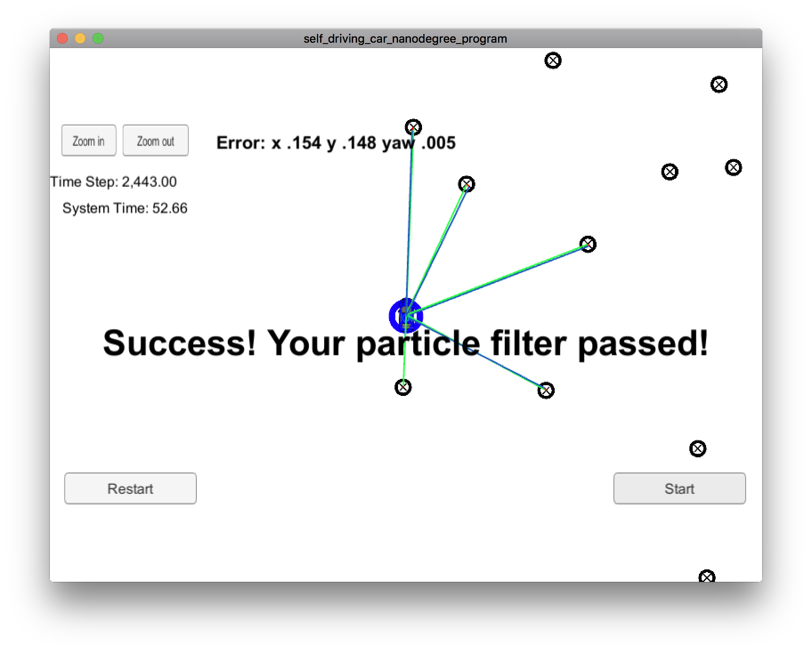

# Tracking a Vehicle with Particle Filters

This project is a part of Udacity's *Self-Driving Car Nanodegree* program. The
goal of the project is to implement Particle Filter algorithm that
locates and tracks a vehicle, using noisy observations. 

## Implementation details 

The boilerplate code for the project was copied from the
[project's repository](https://github.com/udacity/CarND-Kidnapped-Vehicle-Project). I
tried to keep existing code unchanged, yet some pieces had to change in order to
bring more clarity and separate the concepts.

The body of the algorithm is implemented in the class named
`ParticleFilter`. The logic for processing observation data and particle updates
was extracted into helper `ObservationProcessor` class. A bunch of classes in
`world.hpp/world.cpp` file represent specific problem domain concepts, as
follows:

### `CartesianPoint`

Represents a point in Cartesian coordinates. Calculates the Euclidean distance
between points, performs geometric transformations: translation and
rotation. This functionality is useful when we transform the observation's
coordinates from local vehicle coordinate system into the global (map)
coordinates.

### `Observation`

Represents a single observation about a landmark that is in the vehicle's
neighborhood. Landmark's coordinates come in local vehicle coordinate system (X
axis pointing ahead of the vehicle, Y axis pointing to the left). This class can
translate the observation into the global (map) coordinates. It can also
calculate the probability of seeing the observation, assuming Gaussian
distribution of observations around a true landmark. 

### `VehicleState`

Represents the state of the vehicle at a given moment: the position (point), and
the direction (angle w.r.t. global X-axis). Calculates the next state, given the
time delta, observed velocity, and yaw rate. In this project, we use the
*Constant Turn Rate and Velocity (CTRV)* motion model. 

### `Landmark`, `Map`

Represent the world's map, given as a list of landmarks' coordinates. `Map`
class can find a landmark that's closest to a specific point, using a brute-force
Nearest Neighbor search. This feature is utilized when we associate observations
with landmarks on the map. 

## Performance

My implementation passes the simulator test, diving the acceptable error rates
and timing:

## Future improvements

* Brute-force Nearest Neighbor search has *O(n)* complexity for a single query,
  which can become unacceptable when the map is rich in landmarks. For bigger
  maps, more optimal algorithms can be applied (ex. KD-tree search);
  
* In this project, we use Nearest Neighbor search to associate an observation
  with a landmark on the map. However, for dense maps with a lot of landmarks
  close to each other this method can give a lot of false associations. A better
  association method can be applied. 
  
  
  
